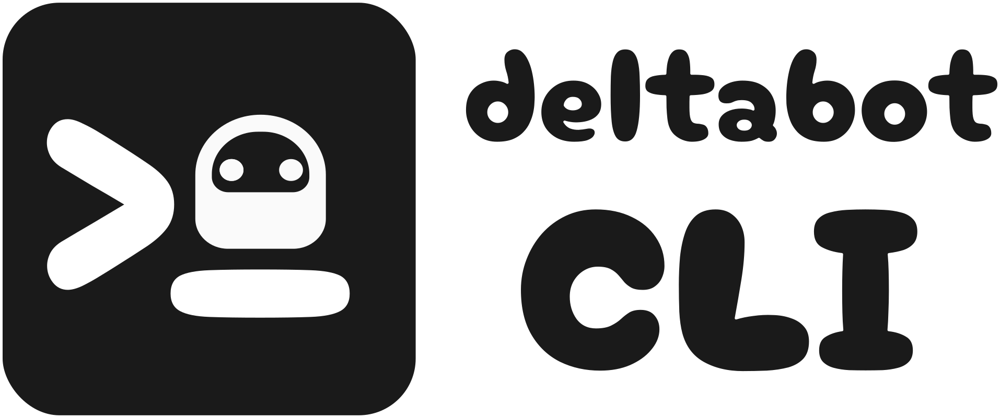

.. title:: deltabot-cli Documentation

-----------------------------

**deltabot-cli** is a library to accelerate chatmail bot development.

-----------------------------

Jump directly into writing your event and message processing logic
and let ``deltabot-cli`` handle the boilerplate of creating CLI interfaces,
configuration management, logging, and runtime setup.

Quick Start Guide
-----------------

Installation
~~~~~~~~~~~~

Install via PyPI:

.. code-block:: bash

    pip install deltabot-cli

Basic Usage
~~~~~~~~~~~

Implementing an echo-bot in a few lines of code:

.. code-block:: python

    from deltachat2 import MessageData, events
    from deltabot_cli import BotCli

    cli = BotCli("echobot")

    @cli.on(events.RawEvent)
    def log_event(bot, accid, event):
        bot.logger.info(event)

    @cli.on(events.NewMessage)
    def echo(bot, accid, event):
        msg = event.msg
        bot.rpc.send_msg(accid, msg.chat_id, MessageData(text=msg.text))

    if __name__ == "__main__":
        cli.start()

Running this script provides:

- A bot CLI interface that allows to configure, run and manage the bot
- Progress bar display during initial configuration
- Pretty-printed structured logs
- Automatic argument parsing and lifecycle management

Documentation Sections
~~~~~~~~~~~~~~~~~~~~~~

.. toctree::
   :maxdepth: 2

   api

